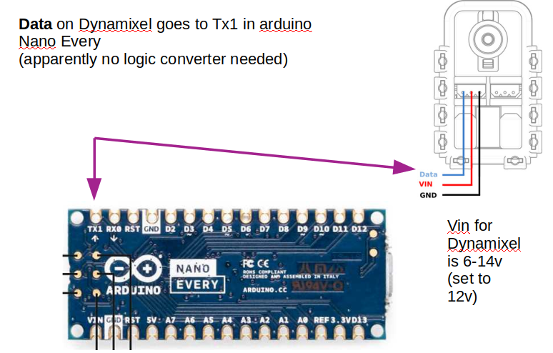

<h1 align="left">README  </h1>


- [Arduino (cameras tilting and pwm synch)](#c_arduino)
- [ROS Time synch 1: Chrony](#c_chrony)
- [ROS Time synch 2: ROS Clock](#c_rosclock)
- [DHCP Server in Husky](#c_dhcp)
- [Groups for sensors](#c_groups)
- [Performed calibration](#c_calibr)
- [Network](#c_netw)


<br><br><a name="c_arduino"></a>

# Arduino (cameras tilting and pwm synch)

The Arduino Nano serves two purposes: 

* Enable the control for the servo motor, that tilts the cameras rig. This is done with *rosserial_arduino*
* Trigger a pwm signal for cameras synchronization (60Hz, Thermal Flir camera requirement)


## Electrical connections


 





## Controlling motor with rosserial

1. List current serial port `ls /dev/ttyACM*`, majority of the times, ACM0 is the thermal camera, and ACM1 is the Arduino.

2. Execute rosserial connection to listen on port for arduino:

```
$ rosrun rosserial_arduino serial_node.py _port:=/dev/ttyACM1 _baud:=57600
$ rosrun rosserial_arduino serial_node.py _port:=/dev/ttyUSB-Arduino _baud:=57600
```

3. Publish required increase/decrease. 
   1. **Home** position is **0**
   2. Positive values tilt camera upward and negative values downwards

`rostopic pub servo_tilt_angle std_msgs/Int16 "data: 0"` 

4. (optional) Listen to current position. **Home** position is **512**

`rostopic echo servo_tilt_angle_ack`


If needed, to reprogram: ros_servo_pwm_synch.ino in 

* `/home/gomezro/ISAsense/arduino4husky/ and/or `~/Dropbox/speed/ISA4/arduino4husky/`

  

  

  If when compiling, Arduino IDE does not count with the libraries, install them:

* library AX-12A-servo-library
* rosserial arduino python (from ROS wiki)


<br><br><a name="c_chrony"></a>

# ROS time synch 1: using Chrony

[Chrony](https://chrony.tuxfamily.org/) configures machines with an NTP (Network Time Provider), setting one server and several slaves. Required to synch the time datastamp accross ROS computers.


## [Installation](https://chrony.tuxfamily.org/doc/4.1/installation.html)

Required dependencies:

* Bison: `sudo apt install bison`
* Asciidoctor: `sudo apt install asciidoctor`

and preferably install with

* Chrony: `sudo apt install chrony`

### [Enable and service status](https://www.tecmint.com/install-chrony-in-centos-ubuntu-linux/)

* check daemon:
  * `systemctl status chronyd `     [On SystemD]
  * `/etc/init.d/chronyd status`    [On Init]

* If you want to enable chrony daemon upon boot, you can use the following command.
  * `systemctl enable chronyd`       [On SystemD]
  * `chkconfig --add chronyd`        [On Init]


## [Configuration](https://chrony.tuxfamily.org/doc/4.1/chrony.conf.html)

Set the Husky to be the Master NTP (server), and the other computers to be the clients (slaves).

* Save a backup copy!!!: **/etc/chrony/chrony.conf**
* Modify Config file accordingly: **/etc/chrony/chrony.conf**  (according to next section)
* Execute **invoke-rc.d chrony restart** after change in /etc/chrony/chrony.conf (which is the important configuration file).
* Test synch in both machines: `chronyc tracking`
* If issues, check the [quick install](https://www.tecmint.com/install-chrony-in-centos-ubuntu-linux/)

> ****Conclusion****: ROS testings for time comparison results
> - Tenth of Nanoeconds-accuracy between machines **chrony**-synched (this setup)
> - Seconds-accuracy between machines **NOT** chrony-synched (using its own NTP)


Some terms to understand:

* **Stepping**: Time changes in large units, quickly; clock jumps abruptly from some incorrect time to some reasonable approximation of the correct time.
* **Slewing**: ntpd adjusts the clock at a maximum rate of x microseconds per second (Time changes slowly). Slewing has the advantage that nothing will get surprised by the sudden change of time.
* The **drift** file is used to store the frequency offset  between the system clock running at its nominal  frequency and the frequency required to remain in synchronization with UTC. If present, the value  contained in the drift file is read at system start and used to correct the clock source.
* **Stratum**: NTP uses a hierarchical, semi-layered system of time sources. Each level of this hierarchy is termed a *stratum* and is assigned a number starting with zero for the reference clock at the top. A server synchronized to a stratum n server runs at stratum n + 1. The number represents the distance from the reference clock


### Current setup: Husky as Server (v2.1.1) and  AISLAP58 as Client (chrony v1.29)

This setup is based on the **Isolated networks ** example of the chrony documentation for every version:

* [Isolated networks v2.1](https://chrony.tuxfamily.org/doc/2.1/manual.html#Isolated-networks)
* [Isolated networks v4](https://chrony.tuxfamily.org/doc/4.1/chrony.conf.html#examples)

### Husky chrony.conf file (SERVER)

```
# Get time from internet server and drift file
server 0.de.pool.ntp.org iburst
driftfile /var/lib/chrony/chrony.drift

# authentication
generatecommandkey
keyfile /etc/chrony/chrony.keys

# "local" enables a local reference mode, 
# which allows chronyd to appear synchronised even when it is not (offline)
local stratum 8

# The rate value in the servers drift file 
# needs to be set to the average rate at which
# the server gains or loses time. chronyd includes
# support for this, in the form of the manual directive 
# and the settime command in the chronyc program
manual

#allow access from clients in network:
allow 192.168.132.0/24
```

Husky retrieves NTP time from a german server (*server 0.de.pool.ntp.org iburst*)  and shares it with clients on the network 192.168.132.0/24 . Husky IP address is 192.168.132.1

### AISLAP58 chrony.conf file (client)

```
#With Husky as the ntp server
server 192.168.132.1 iburst
driftfile /var/lib/chrony/chrony.drift
logdir /var/log/chrony
log measurements statistics tracking
keyfile /etc/chrony/chrony.keys
generatecommandkey
allow 192.168.132.0/24
makestep 1.0 3
```


## Test in bash

* To display a continuos clock

``` bash
while :; do printf '%s\r' "$(date +%r)"; sleep 1 ; done
```

* check in master and in client

``` bash
chronyc tracking
chronyc sources
```


* Reference ID – the reference ID and name to which the computer is currently synced.
* Stratum – number of hops to a computer with an attached reference clock.
* Ref time – this is the UTC time at which the last measurement from the reference source was made.
* System time – delay of system clock from synchronized server.
* Last offset – estimated offset of the last clock update.
* RMS offset – long term average of the offset value.
* Frequency – this is the rate by which the system’s clock would be wrong if chronyd is not correcting it. It is provided in ppm (parts per million).
* Residual freq – residual frequency indicated the difference between the measurements from reference source and the frequency currently being used.
* Skew – estimated error bound of the frequency.
* Root delay – total of the network path delays to the stratum computer, from which the computer is being synced.
* Leap status – this is the leap status which can have one of the following values – normal, insert second, delete second or not synchronized.


## ROS test pkg

Pkg **chrony_test**, three publisher nodes that use topics

* chatter_time (to be run in Husky)
* chatter_time_speed (to be run in speed)
* chatter_time_aislap58

and a single subscriber node reading the three topics

```
husky$    rosrun chrony_test publCurrTime_node
speed$    rosrun chrony_test publCurrTime_speed_node
aislap58$   rosrun chrony_test publCurrTime_aislap58_node
whichever$  rosrun chrony_test subscCurrTime_node
```


<br><a name="c_rosclock"></a>

# ROS time synch 2: using [ROS Clock](http://wiki.ros.org/Clock)

ROS Clock configures an "universal" clock for all the ROS environment: instead of using the omputer's system clock (a.k.a. wall-clock), nodes use the "/clock" topic. But this functionality is not useful for our setup, instead , is more valuable for setups where we want to speed up processes, or delay them, etc. NOT for real time systems!!!


<br><a name="c_dhcp"></a>

# DHCP server in Husky, [isc-dhcp-server](https://wiki.debian.org/DHCP_Server)

## Install 

`$ sudo apt install isc-dhcp-server`

## Basic config

Modify following files accordingly


* /etc/default/isc-dhcp-server  as (eth0 in aislap58, br0 in husky)

`    INTERFACES="eth0"`

* /etc/dhcp/dhcpd.conf  as 

```
default-lease-time 600;
max-lease-time 7200;
authoritative;
log-facility local7;

subnet 192.168.132.0 netmask 255.255.255.0 {
  range                      192.168.132.2 192.168.132.250;
  option routers             192.168.132.1;  #Gateway, this computer
  option subnet-mask         255.255.255.0;
  option broadcast-address   192.168.132.255;
  #option domain-name-servers 192.168.132.1;
}

#Fixed ip addresses

host enose-husky132 {
  hardware ethernet b8:27:eb:6b:9e:1b;
  fixed-address 192.168.132.23;
}

host irkam-husky132 {
  hardware ethernet 02:49:54:00:15:67;
  fixed-address 192.168.132.24;
}

host uvmodule-husky132 {
  hardware ethernet b8:27:eb:fe:40:53;
  fixed-address 192.168.132.25;
}

host dotcube-husky132 {
  hardware ethernet 8c:ae:4c:e1:56:c9;
  fixed-address 192.168.132.26;
}

host microphone-husky132 {
  hardware ethernet dc:a6:32:4b:23:fb;
  fixed-address 192.168.132.27;
}

host rgb1-20243318-husky132 {
  hardware ethernet 2C:DD:A3:34:E3:76;
  fixed-address 192.168.132.28;
}

host rgb2-20039932-husky132 {
  hardware ethernet 2C:DD:A3:31:C8:FC;
  fixed-address 192.168.132.29;
}

host lidar-husky132 {
  hardware ethernet BC:0F:A7:00:22:C7;
  fixed-address 192.168.132.30;
}


#host aislap58-husky132 {
#  hardware ethernet 00:16:D3:30:11:C0;
#  fixed-address 192.168.132.58;
#}


host adriana-asus-husky132 {
  hardware ethernet 00:11:6B:67:DB:5A;
  fixed-address 192.168.132.59;
}

#host husky-eth-husky132 {
#  hardware ethernet 00:30:18:05:43:60;
#  fixed-address 192.168.132.60;
#}

```

* /etc/network/interfaces  as  (I want this computer to be the dhcp provider)

```
auto eth0
iface eth0 inet static
    address         192.168.132.1
    netmask         255.255.255.0
    broadcast       192.168.132.255
```

* /etc/network/interfaces  For other clients

```
    auto eth0
    iface eth0 inet dhcp
```


## Disable (for aislap58 and starting in husky )


To prevent running DHCP server after reboot, you must update init scripts by update-rc.d:

`
sudo update-rc.d -f isc-dhcp-server remove
`


If you want to add DHCP Server to startup again, enter this command:

`
sudo update-rc.d isc-dhcp-server defaults
`


and another alternative


`
sudo systemctl disable isc-dhcp-server.service
`


## Clients

* husky **192.168.132.1**
* enose-husky132  **192.168.132.23**
* irkam-husky132  **192.168.132.24**
* uvmodule-husky132  **192.168.132.25**
* dotcube-husky132  **192.168.132.26**
* microphone-husky132   **192.168.132.27**
* rgb1-20243318-husky132  **192.168.132.28**
* rgb2-20039932-husky132  **192.168.132.29**
* lidar-husky132  **192.168.132.30**
* gps-wifi-husky132  **192.168.132.31** WiFi
* aislap58-husky132  **192.168.132.58**
* adriana-asus-husky132  **192.168.132.59**


<br><a name="c_groups"></a>

# Permissions and groups for the different sensors

Format

`
sudo usermod -a -G groupName userName
`

And what we need:

```
$ sudo usermod -aG flirimaging husky
$ sudo usermod -aG infratec husky
$ sudo usermod -aG dialout husky
```


<br><a name="c_calibr"></a>

# Calibration

Calibration procedures, with developed packages for different sensors. Images taken at **4 Hz** (fps). This is set in spinnaker and filr_adk launch files

Check the [Dedicated project](https://github.com/AdriannaGmz/kalib_husky)


As a "Dirty calibration", for extrinsics, the following transformations are provided (taken from measurements with the CAD file and refining with the cameras view from rviz).

```

// Manual 'dirty' calibration
--
/* base_link → cam0l_link,  Left camera, ip 28 */
  frame_id = "base_link";
  translation.x = 0.260;  
  translation.y = 0.20;
  translation.z = 0.650;
  RPY(-1.571, 0, -1.571);    // Rotation [rad]  roll pitch yaw 

// ...
/* base_link → cam1r_link,  Right camera, ip 29 */
  translation.x = 0.260;  
  translation.y = -0.05;
  translation.z = 0.650;
  RPY(-1.571, 0, -1.571);    

// ...
/* base_link → os_sensor */
  translation.x = -0.232;  
  translation.y = 0.138;
  translation.z = 1.057;
  RPY(0, 0, -1.571);    
```


Intrinsic parameters for RGB cameras obtained with Kalibr.


```
cam0:
  cam_overlaps: [1]
  camera_model: pinhole
  distortion_coeffs: [-0.19055686474229397, 0.05586346249249971, -8.031519283962964e-06, 0.00028201931934843626]
  distortion_model: radtan
  intrinsics: [252.01005633486346, 251.61370309819347, 256.7578657984281, 195.86967490998143]
  resolution: [512, 384]
  rostopic: /camera_array/cam0Left/image_raw
cam1:
  T_cn_cnm1:
  - [0.9999510170767547, -0.0047020537584497426, -0.008709428087979405, -0.22322454988244986]
  - [0.0046987866937563, 0.9999888824130448, -0.00039554256319492914, -0.0006405008415574938]
  - [0.00871119112255119, 0.0003545994435538903, 0.9999619939820034, -0.0016269850404922737]
  - [0.0, 0.0, 0.0, 1.0]
  cam_overlaps: [0]
  camera_model: pinhole
  distortion_coeffs: [-0.18632970028739196, 0.05197788014677443, 0.00013398922087546675, -0.0005761540961894324]
  distortion_model: radtan
  intrinsics: [252.43411622116585, 251.94430280583938, 254.91411788048075, 195.0275076389239]
  resolution: [512, 384]
  rostopic: /camera_array/cam1Right/image_raw
```


And here, the extrinsics between Camera and Lidar (overriding base_link or any other frame). Obtained with package  [lidar_cam](https://github.com/ankitdhall/lidar_camera_calibration)   (and slightly modified by Kursat and Johannes)


```
[INFO] [1681756777.263812, 1681746126.829720]: Re-projection error before LM refinement (RMSE) in px: 2.9010542941757067
Number of inliers: 86
[INFO] [1681756777.265232, 1681746126.829720]: Re-projection error after LM refinement (RMSE) in px: 2.9010542941756583

Euler angles (RPY): (1.6099063254941655, -0.026306325827184545, -0.013521035056481983)
Rotation Matrix: [[ 0.99956263 -0.02680943 -0.01248192]
                  [-0.01351595 -0.03874109 -0.99915787]
                  [ 0.02630329 0.99888957 -0.0390865 ]]
Translation Offsets: [[-0.22648084 -0.43903306 -0.55559062]]

```


<br><a name="c_netw"></a>

# Network

Network configuration and other related notes

|                            | iface                 |                             mac                              |                              ip                              |
| -------------------------- | --------------------- | :----------------------------------------------------------: | :----------------------------------------------------------: |
| **husky**, intel wifiAX200 | wifi                  |                      dc:21:48:56:97:c1                       |                      **192.168.131.5**                       |
| **husky**, eth upgrade     | eth                   |         Eth 00:22:4D:D8:D6:9A (eno1) and 9B (enp1s0)         | 192.168.131.2 (eno1, if aisrobots), *192.168.132.1* (eno1), 192.168.131.3 (enp1s0, if aisrobots) *192.168.133.1* (enp1s0), |
| husky (factory board)      | eth/wifi (usb dongle) | Eth 00:30:18:05:43:60 and 61; onboard Wifi b8:b7:f1:c0:54:91, wifi usb dongle: 00:0f:00:be:1b:ec | 192.168.132.1 (eno1), 192.168.133.1 (enp1s0), 192.168.131.4 (wifi) |
| enose                      | eth                   |                      b8:27:eb:6b:9e:1b                       |                        192.168.132.23                        |
| irKam                      | eth                   |                      02:49:54:00:15:67                       |                      192.168.**133**.24                      |
| uvMod                      | eth                   |                      b8:27:eb:fe:40:53                       |                        192.168.132.25                        |
| dotCube                    | eth                   |                      8c:ae:4c:e1:56:c9                       |                        192.168.132.26                        |
| AoA mic                    | eth                   |                      dc:a6:32:4b:23:fb                       |                        192.168.132.27                        |
| rgb1 20243318              | eth                   |                      2C:DD:A3:34:E3:76                       |                        192.168.132.28                        |
| rgb2 20039932              | eth                   |                      2C:DD:A3:31:C8:FC                       |                        192.168.132.29                        |
| thermal                    | usb                   |                                                              |                                                              |
| imu                        | usb                   |                                                              |                                                              |
| lidar                      | eth                   |                      bc:0f:a7:00:22:c7                       |                        192.168.132.30                        |
| gps                        | wifi                  |                      D4:12:43:53:B5:6E                       |                        192.168.13x.31                        |
| -*Laptops* -               |                       |                                                              |                                                              |
| husky-z1                   | eth                   |                      9c:7b:ef:41:f5:39                       |                        192.168.131.41                        |
| speed                      | eth                   |                      54:04:a6:f1:8a:13                       |                       192.168.131.169                        |
| arola5                     | eth / wifi            |           38:f3:ab:f3:8b:e6   /  58:6c:25:e6:63:51           |                 192.168.131.35/36 (eth/wifi)                 |
| adriana-asus-husky132      |                       |                         eth adapter                          |                        192.168.132.59                        |


### Local network - eth from Husky-

> **192.168.132.1** is the **ROS_MASTER_URI**

* Husky eth ip address for local network: 192.168.132.1 and 192.168.133.1

* Husky wifi ip address for connecting to external network: 192.168.131.5


### External network - Husky over wifi-


In the **external computer** connected to the same network than the Husky Wifi, create a route to access internal network (192.168.132.0/24) in Husky using the Husky wifi ip address as gateway. 

*Although it might break connectivity in other programs talking to internet*. This can be set as default in  `/etc/network/interfaces`: 

`sudo route add -net 192.168.132.0 netmask 255.255.255.0 gw 192.168.131.5`

_Caramac_ does not use **ifup** for network management (/etc/network/interfaces). Instead, it uses **netplan**, and it should be configured in `/etc/netplan/01-netcfg.yaml`:

```
# This file describes the network interfaces available on your system
# For more information, see netplan(5).
network:
  version: 2
  renderer: networkd
  ethernets:
    enp0s25:
      dhcp4: yes
      routes:
      - to: 192.168.132.0/24
        via: 192.168.131.5 

```

For permanent setup in the _husky-z1_ server, in */etc/network/interfaces*, add the line for the interface (where eno1 is the interface:
```
      auto eno1
      iface eno1 inet dhcp
      up route add -net 192.168.132.0/24 gw 192.168.131.5 dev eno1
```


The new ip route is shown with cmd `route`  (or `ip route show` ) in the last line as *192.168.131.5* has been previously declared in **/etc/hosts** as PH13FEI:

> gomezro@caramac:~/ws/navigation_test_ws$ route 
> Kernel IP routing table
> Destination     Gateway         Genmask         Flags Metric Ref    Use Iface
> default         _gateway        0.0.0.0         UG    100    0        0 enp0s25
> default         _gateway        0.0.0.0         UG    20600  0        0 wlp3s0
> link-local      0.0.0.0         255.255.0.0     U     1000   0        0 wlp3s0
> 172.17.0.0      0.0.0.0         255.255.0.0     U     0      0        0 docker0
> 192.168.131.0   0.0.0.0         255.255.255.0   U     0      0        0 enp0s25
> 192.168.131.0   0.0.0.0         255.255.255.0   U     600    0        0 wlp3s0
> _gateway        0.0.0.0         255.255.255.255 UH    100    0        0 enp0s25
> **192.168.132.0   PH13FEI         255.255.255.0   UG    0      0        0 enp0s25**


Register the husky as host in /etc/hosts:    192.168.131.5   PH13FEI


And in the same external computer, declare :

```
export ROS_MASTER_URI=http://192.168.131.5:11311
export ROS_IP=192.168.131.x
```


## SSH

* Use `ssh-copy-id` to copy ssh keys
* To modify bash and source ws when ssh logged in:
  *  /etc/profiles, ~/.bash_profile,  ~/.bash_login,  and  ~/.profile

```
# it  first reads and executes commands from the file /etc/profile, if
       that file exists.  After reading that file, it  looks  for
       ~/.bash_profile,  ~/.bash_login,  and  ~/.profile, in that
       order
```

  * In Husky, add in `nano ~/.profile`

```
cd /home/husky/ws/navigation_test_ws
source devel/setup.bash
```

  * In Caramac, create a  `nano ~/.profile`:

```
# ~/.profile: executed by the command interpreter for login shells.
# This file is not read by bash(1), if ~/.bash_profile or ~/.bash_login
# exists.
# see /usr/share/doc/bash/examples/startup-files for examples.
# the files are located in the bash-doc package.

# the default umask is set in /etc/profile; for setting the umask
# for ssh logins, install and configure the libpam-umask package.
#umask 022

# if running bash
if [ -n "$BASH_VERSION" ]; then
    # include .bashrc if it exists
    if [ -f "$HOME/.bashrc" ]; then
        . "$HOME/.bashrc"
    fi
fi

# set PATH so it includes user's private bin if it exists
if [ -d "$HOME/bin" ] ; then
    PATH="$HOME/bin:$PATH"
fi

# set PATH so it includes user's private bin if it exists
if [ -d "$HOME/.local/bin" ] ; then
    PATH="$HOME/.local/bin:$PATH"
fi


# dagr, for ssh logins
source /opt/ros/melodic/setup.bash

cd /home/gomezro/ws/navigation_test_ws
source devel/setup.bash
export ROS_IP=192.168.131.40
export ROS_MASTER_URI=http://192.168.131.5:11311
```

